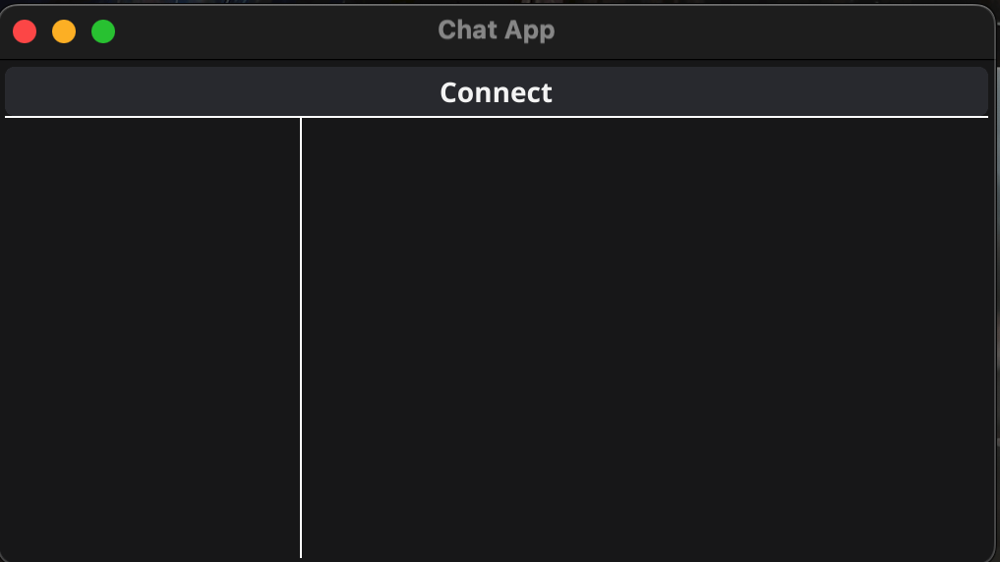
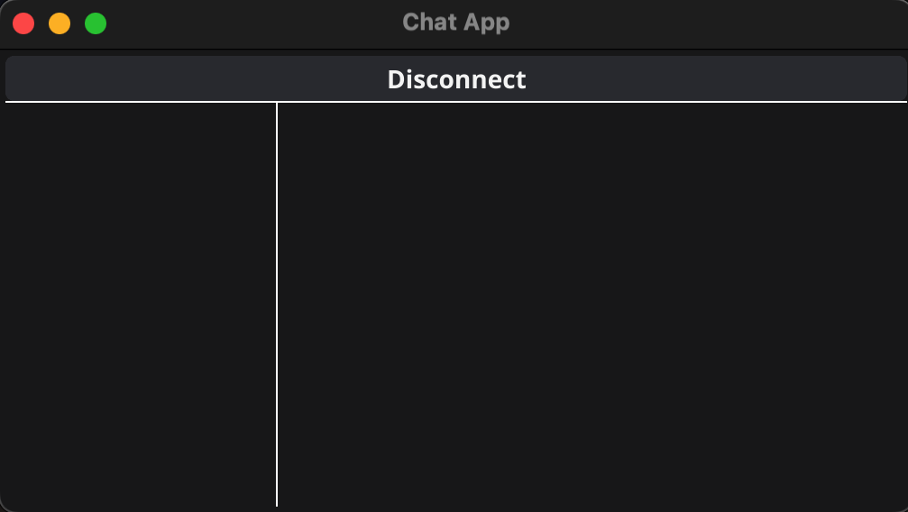

# WebSocket Chat App with Fyne GUI
A real-time chat application built with:
- **Go** for the backend
- **Fyne** for cross-platform GUI
- **WebSockets** for live messaging

  
### INITIAL UI

  
  

